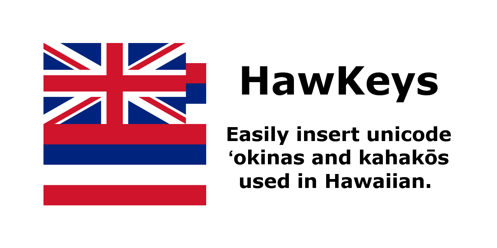
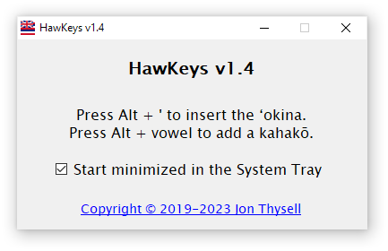

# HawKeys #

HawKeys is a small application to make it easy to insert the proper Unicode characters for the [ʻokina](http://www.olelo.hawaii.edu/olelo/puana/okina.php) and [kahakōs](http://www.olelo.hawaii.edu/olelo/puana/kahako.php) used in the Hawaiian language.

HawKeys requires .NET 2.0 and should work on Windows XP SP3 and later.

## Installation ##

### Microsoft Store Version (Windows 10+) (Recommended) ###

HawKeys is available on the Microsoft Store.

1. Get the latest version from: https://www.microsoft.com/en-us/p/hawkeys/9nh9633zwkbp
2. Run HawKeys from the Start Menu

### Portable Version (Windows XP SP3+) ###

HawKeys is also available as small executable that should run on any Windows machine with .NET 2.0 installed.

1. Download the latest HawKeysBinaries zip file from https://github.com/jonthysell/HawKeys/releases/latest
2. Extract the zip file
3. Double-click HawKeys.exe

You should now see the HawKeys window running:

## Hotkey Usage ##

With HawKeys running, you now have access to the following hotkeys throughout Windows:

| Hotkey          | Letter |
|:----------------|:-------|
| Alt + '         | ʻ      |
| Alt + a         | ā      |
| Alt + Shift + a | Ā      |
| Alt + e         | ē      |
| Alt + Shift + e | Ē      |
| Alt + i         | ī      |
| Alt + Shift + i | Ī      |
| Alt + o         | ō      |
| Alt + Shift + o | Ō      |
| Alt + u         | ū      |
| Alt + Shift + u | Ū      |

## Run HawKeys in the Background ##

You can run HawKeys in the background, (i.e. not have the window visible all the time) by minimizing it to your System Tray (the area on the Taskbar near the clock). Double-clicking on the HawKeys icon will re-open the window.

You can also check the box labeled "Start minimized in the System Tray", so that you don't need to manually minimize HawKeys every time it launches.

## Start HawKeys on System Startup ##

You can configure HawKeys to start up automatically when you log into your computer.

### Microsoft Store Version ###

1. Make sure you've run HawKeys at least once
2. Right-click on your Taskbar and select "Task Manager"
3. Click on the "Startup" tab at the top of the window (if you don't see any tabs, click on the "More details" arrow at the bottom left)
4. Select "HawKeys" in the list of applications
5. Click the "Enable" button in the bottom right of the window

### Portable Version ###

1. Press the Win + R keys on your keyboard to open the "Run" dialog
2. Type the following (without the quotes) into the textbox: "shell:startup"
3. Click "OK"
4. Place HawKeys.exe (or a shortcut to HawKeys.exe) into the "Startup" folder that should have opened

Now HawKeys should run automatically whenever you log into your computer.

## Errata ##

HawKeys is open-source under the MIT license.

HawKeys Copyright (c) 2019-2023 Jon Thysell
